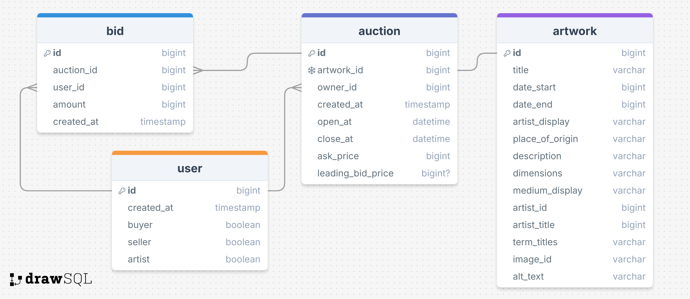

# Magnum Opus

## Pre-requisite

To implement this application, please also set up the front end. The repository and instructions for the front end application can be found here: [magnum-opus](https://github.com/BriAnWuu/magnum-opus)

### Installation

Clone this repository to your local folder:

```shell
git clone https://github.com/BriAnWuu/magnum-opus-api.git
```

Navigate into your project folder and install dependencies(resource for package manager [npm](https://nodejs.org/en/download/package-manager)):

```sell
npm install
```

### Configure Environment

Create a `.env` file to store your database credentials, following the format in `.env.example`:

```
PORT=8080
DB_HOST=127.0.0.1
DB_NAME=<YOUR_DB_NAME>
DB_USER=<YOUR_DB_USER_NAME>
DB_PASSWORD=<YOUR_DB_USER_PASSWORD>
```

Set up database locally using your credentials above. More resource on MySQL can be found [here](https://www.mysql.com/)

### Populate Database with Mock Data

Under your project folder, run commands in terminal:

```shell
npm run migrate
npm run seed
```

### Trouble Shooting Database

Because my database has very strict deleting and updating rules, in order to reset the data in your database, run:

```shell
npm run migrate:rollback
npm run migrate
npm run seed
```

Simply run `seed` will be denied.

There will be time when you want to regenerate random timestamp data for `open` and `close`, I found [FakerJS Date](https://fakerjs.dev/api/date.html#betweens) very useful.

UPDATES:
- 2024 Dec 14: `npm run seed` now incorporates random dates generation, details can be found in `/data`, `/utils`, and `/seeds` folders.

### Launch the Application

Launch the server in your terminal:

```shell
npm run dev
```

Be sure that front end app is also running in your browser.

---

## Overview

Magnum Opus is your favourite art auction platform for discovering great craftsmanship, creativity, and vision. Magnum Opus connects you with art that inspires and endures. Discover, bid, and own a piece of the extraordinary today.

### Problem Space

Compared to traditional auctions, an art auction platform breaks geographical barriers, allowing collectors and buyers from around the world to discover and acquire art from the comfort of their homes. It also provides owners with a specialized venue to showcase rare, high-value, or exclusive pieces that might not find the right audience through traditional retail channels. Moreover, such a platform can empower both emerging and established artists by giving them exposure to a global audience and helping them receive fair market value for their work. Most importantly, an art auction platform brings people together, collectors, investors, and art lovers, fostering a sense of community and a shared passion for art.

### User Profile

- Buyers:
    - looking for a great art piece to collect
    - looking for art ownership at a fair price
    - that want to follow the work of their favourite artists
- Artists and Owners:
    - gaining exposure to broader audience
    - establishing connections with potential patrons
    - looking to sell an art work at a fair price
- Art Fans:
    - that want to discover a wide variety of art
    - looking to learn more about art
    - looking to support their favourite artists or collectors

### Features

- Exhibition of Artworks
- Bidding on Artworks
- Real-time updates on Artworks

## Implementation

### Tech Stack

- React
- Express
- MySQL

- Client libraries:
    - axios
    - html-react-parser
    - framer-motion
    - react
    - react-router
    - react-text-mask
    - react-use-measure
    - sass
- Server libraries:
    - cors
    - dotenv
    - express
    - knex
    - mysql2
    - socket.io

### APIs

- [Art Institute of Chicago API](https://api.artic.edu/docs/#introduction): Artwork data scraping
- [Faker.js](https://fakerjs.dev/): Mock data generation
- [RoboHash](https://robohash.org/): Mock user profiles generation

### Sitemap

- Home page
- Artworks page
- Artwork detail page
- Bidding page

### Mockups

#### Home page
#### Artworks page
#### Artwork detail page
#### Bidding page

### Data



### Endpoints

**GET /artworks**

- Get a list of artworks from database

**GET /artworks /:id**

- Get single artwork by artwork id

**GET /auction /:artworkId**

- Get single auction by artwork id

**GET /auction /:id /bids**

- Get a list of bids on the auction

**POST /bid**

- Create a new bid on an artwork

**PATCH /user /:id**

- Update user data

## Roadmap

- Create client
    - front end react project with routes

- Create server
    - back end express project

- Data collection
    - use Javascript and Art API to store data in server and MySQL
    - artwork detail data -> MySQL
    - artwork image -> express static

- Server end points

- Choose auction rules (type of auction)

- Github repo set up

- Home page
    - Hero and Nav
    - Main: parallax scrolling gallery
    - More auctions: link to Artworks page
    - Footer

- Artwork detail page
    - Image: zoom in portion of image when hover
    - Information of the artwork
    - Start bidding: link to bidding page of the work

- Artworks page
    - Gallery of artworks
    - Show bidding price for each
    - Show count down to auction close for each

- Set up websocket for bidding functionality

- Bidding page
    - Image: zoom in portion of image when hover
    - Brief info of the artwork
    - List of bids and leading bid


## Nice-to-haves

- Speech recognition for bidding

- Search function
    - Search artwork
    - Search artist or owners
    - Search by auction listing date

- Sorting and grouping functions
    - Sort by year, etc.
    - Group by artist, style, year, or country of origin

- Recommendation based on artworks visited

- Login to differentiate user types (buyers, seller, artist, etc.)

- Follow other users

---

## Future Implementations
