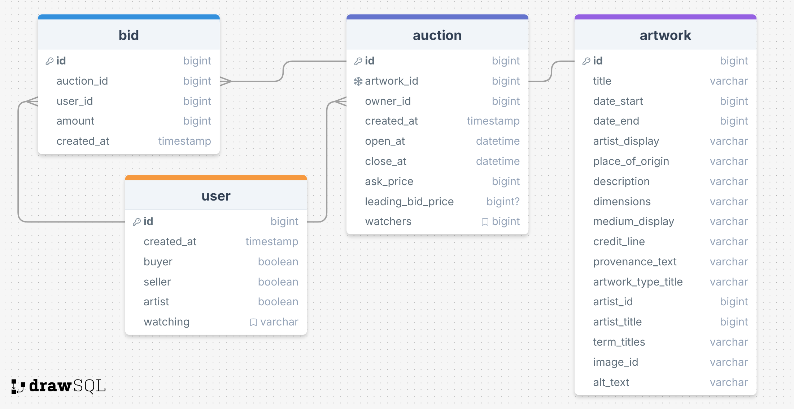

# Magnum Opus

## Overview

Magnum Opus is your favourite art auction platform for discovering great craftsmanship, creativity, and vision. Magnum Opus connects you with art that inspires and endures. Discover, bid, and own a piece of the extraordinary today.

### Problem Space

Compared to traditional auctions, an art auction platform breaks geographical barriers, allowing collectors and buyers from around the world to discover and acquire art from the comfort of their homes. It also provides owners with a specialized venue to showcase rare, high-value, or exclusive pieces that might not find the right audience through traditional retail channels. Moreover, such a platform can empower both emerging and established artists by giving them exposure to a global audience and helping them receive fair market value for their work. Most importantly, an art auction platform brings people together, collectors, investors, and art lovers, fostering a sense of community and a shared passion for art.

### User Profile

- Buyers:
    - looking for a great art piece to collect
    - looking for art ownership at a fair price
    - that want to follow the work of their favourite artists
- Artists and Owners:
    - gaining exposure to broader audience
    - establishing connections with potential patrons
    - looking to sell an art work at a fair price
- Art Fans:
    - that want to discover a wide variety of art
    - looking to learn more about art
    - looking to support their favourite artists or collectors

### Features

List the functionality that your app will include. These can be written as user stories or descriptions with related details. Do not describe _how_ these features are implemented, only _what_ needs to be implemented.

## Implementation

### Tech Stack

- React
- Express
- MySQL
- Client libraries:
    - react
    - react-router
    - axios
    - framer-motion
- Server libraries:
    - knex
    - express
    - socket.io

### APIs

[Art Institute of Chicago API](https://api.artic.edu/docs/#introduction)

### Sitemap

- Home page
- Artworks page
- Artwork detail page
- Bidding page

### Mockups

Provide visuals of your app's screens. You can use pictures of hand-drawn sketches, or wireframing tools like Figma.

#### Home page
#### Artworks page
#### Artwork detail page
#### Bidding page

### Data

### Endpoints

**GET /artworks**

- Get a list of artworks from database

**GET /artworks /:id**

- Get single artwork by artwork id

**GET /auction /:id**

- Get single auction by auction id

**GET /auction /:id /bids**

- Get a list of bids on the auction

**POST /bid**

- Create a new bid on an artwork

**PATCH /user /:id**

- Update user data

## Roadmap

- Create client
    - front end react project with routes

- Create server
    - back end express project

- Data collection
    - use Javascript and Art API to store data in server and MySQL
    - artwork detail data -> MySQL
    - artwork image -> express static

- Server end points

- Choose auction rules (type of auction)

- Github repo set up

- Home page
    - Hero and Nav
    - Main: parallax scrolling gallery
    - More auctions: link to Artworks page
    - Footer

- Artwork detail page
    - Image: zoom in portion of image when hover
    - Information of the artwork
    - Start bidding: link to bidding page of the work

- Artworks page
    - Gallery of artworks
    - Show bidding price for each
    - Show count down to auction close for each

- Set up websocket for bidding functionality

- Bidding page
    - Image: zoom in portion of image when hover
    - Brief info of the artwork
    - List of bids and leading bid

## Nice-to-haves

- Speach recognition for bidding

- Search function
    - Search artwork
    - Search artist or owners
    - Search by auction listing date

- Sorting and grouping functions
    - Sort by year, etc.
    - Group by artist, style, year, or country of origin

- Recommendation based on artworks visited

- Login to differentiate user types (buyers, seller, artist, etc.)

- Follow other users

---

## Future Implementations
Your project will be marked based on what you committed to in the above document. Here, you can list any additional features you may complete after the MVP of your application is built, or if you have extra time before the Capstone due date.

